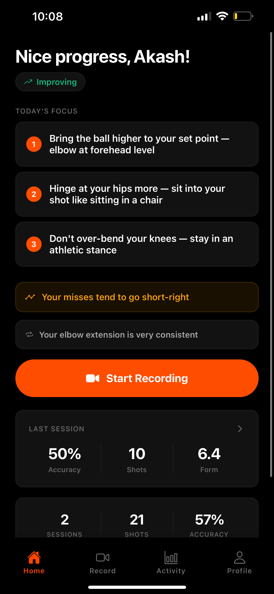
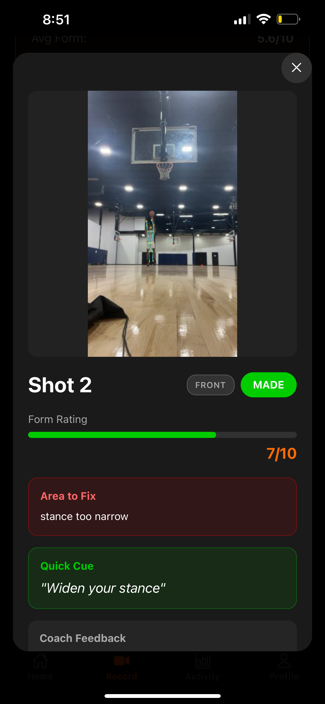
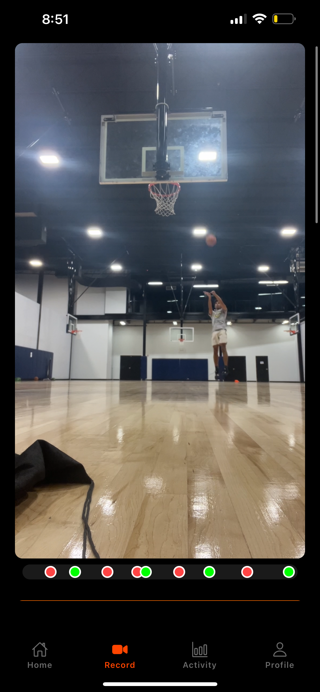
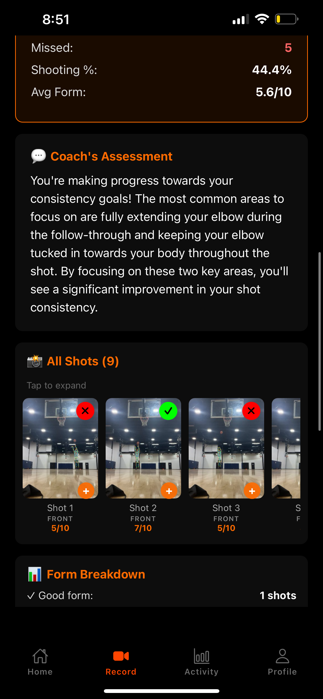
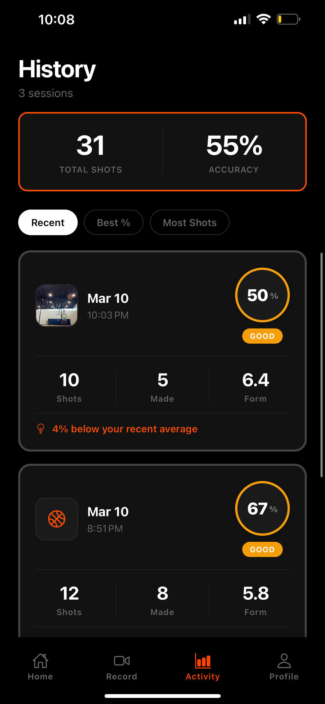
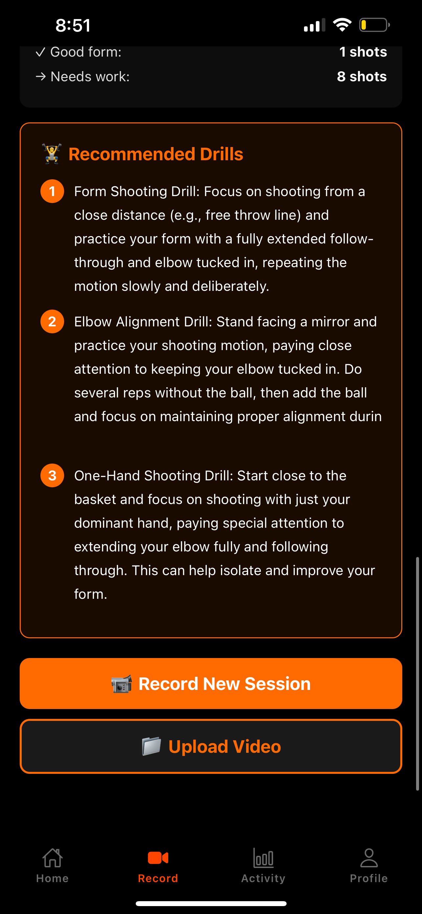

# ShotDoc

Hey, I created this project as someone new to AI-assisted coding, App dev, and deploying real code to users (i'm also not particularly good at shooting a basketball). I've always taken videos of my shooting form and wished there was a central hub, where I could see my shooting trends and improvement areas. I built this with the assistence of claude code to solve that exact problem, but it's definitely still a work in progress. I plan to publish this to the App store and work on new features including a tutorial section, shooting charts, and better make/miss detection. Feel free to tinker with the approach or suggest ideas for improvement! 
> **Status:** In active development. Backend deployed on Railway. iOS app in TestFlight beta.

## Screenshots

<table>
  <tr>
    <td align="center"><br/><sub>Home</sub></td>
    <td align="center"><br/><sub>Shot Analysis</sub></td>
    <td align="center"><br/><sub>Live Session</sub></td>
  </tr>
  <tr>
    <td align="center"><br/><sub>Session Results</sub></td>
    <td align="center"><br/><sub>History</sub></td>
    <td align="center"><br/><sub>Profile</sub></td>
  </tr>
</table>

## What It Does

You set your phone on a tripod, record yourself shooting, and upload the video. ShotDoc processes the whole thing automatically: it finds every shot you took, analyzes your form on each one, determines whether it went in, and gives you specific coaching cues on what to fix. No manual logging. No tagging. Just shoot and get feedback.

The coaching is personalized — the system compares your misses against your own makes, not against textbook form. Every player has different biomechanics, so "elbow at 90 degrees" is meaningless advice. What matters is why *your* shot goes in versus when it doesn't.

## How It Works

```
Mobile App (React Native/Expo)
    ↓
Video Upload
    ↓
Pose Estimation (MediaPipe) → Shot Detection
    ↓
Ball Tracker (YOLO) → Trajectory    Rim Detector → Rim Position + Size
    ↓                                     ↓
Trajectory Analysis              Three-Layer Make/Miss Fusion
    ↓                                     ↓
Frame Extraction → Gemini 2.0 Flash → Form Analysis + Coaching Cues
    ↓
Results stored in Supabase → Displayed in app
```

## The Hard Problems

Building this looked straightforward on paper. In practice, nearly every component turned out to be a distinct unsolved problem. Here's an honest account of what we ran into and how we dealt with it.

---

### 1. Shot Detection

**The naive approach failed immediately.** The obvious method — watch for elbow extension above a threshold — fires constantly during dribbling, pump fakes, and passing. Real-world basketball video is noisy.

**The insight:** We inverted the problem. Instead of trying to detect when a shot *starts*, we detect when it *ends*. The release point is unambiguous: elbow angle exceeds 155°, wrist is above the shoulder. That happens once per shot and almost never otherwise. Once we find the release, we work backward through the previous 60 frames to find the load point (minimum elbow angle, which is the deepest knee bend). Everything between load and release *is* the shot.

This brought false positives from ~40% down to under 5%, and it works regardless of shooting style because every jump shot has a release — no matter how unconventional the form getting there.

We then extract 20 frames distributed across the load-to-release window, weighted toward the upstroke, and send those to Gemini for form analysis.

---

### 2. Ball Tracking

**The ball is small, fast, and disappears constantly.** We use a YOLOv8 model to track the basketball through each shot. This works well most of the time, but there are two systematic failure modes:

**Problem 1: The ball vanishes at the apex.** When the ball is at its highest point, it's near the rim — which often occludes it. The tracker loses it right at the most important moment for make/miss determination. We can't just use the last known position.

**Problem 2: False detections.** The tracker sometimes picks up the player's head or an orange-colored object in the background, especially in gym lighting. This produces a trajectory that looks reasonable but is completely wrong.

We built a trajectory cleaning step that removes outlier detections using an interquartile range filter. Ball detections that are too far from the expected parabolic path get dropped. The remaining trajectory gets smoothed before being passed to make/miss analysis. When the tracker loses the ball entirely, we defer to Gemini rather than guessing.

---

### 3. Make/Miss Detection

This was by far the hardest problem, and we iterated on it the most.

**Attempt 1: Trajectory only.** Check whether the ball's trajectory passes through the rim (above and below the rim's y-coordinate within a horizontal window). Works great for side-view shots where the trajectory is clean. Falls apart for front-view shots, shots where the tracker loses the ball at the apex, and any shot where the rim is partially occluded.

**Attempt 2: Gemini only.** Show Gemini the outcome frames (the ~50 frames after ball release) and ask it to determine if the ball went through the hoop. This works surprisingly well but has a specific failure mode: if the ball is out of frame or the resolution is low, Gemini hallucinates. We saw it confidently call made shots as misses and vice versa.

**The actual solution: Three-layer fusion.**

1. **Trajectory analysis** runs first. If it's confident (ball clearly above and below rim, near the right x-coordinate), we use it.
2. **Rim radius auto-calibration.** Early on, we were using a hardcoded threshold of 2% of frame width (~21px) for what counts as "near the rim." An actual detected rim was 55px — more than double. That meant shots that narrowly went in were being marked UNCLEAR because they didn't come close enough to a rim that was almost half the size we thought it was. We now scan 8 sample frames at startup using Hough circle detection + HSV color analysis to measure the actual rim size in pixels, and scale all thresholds from that.
3. **Ascending-near-rim heuristic.** If the ball is near the rim but still moving upward, the tracker almost certainly lost it before the apex. Rather than calling this a miss (the ball never came back down in our data), we return UNCLEAR and let Gemini decide.
4. **Gemini fallback.** When trajectory analysis is UNCLEAR, we send Gemini the outcome frame window. Gemini is better at visual "did it go in" judgment than we expected, especially for clear makes. It struggles most with near-rim misses.

The current accuracy on our test footage is around 85–90%, which is good enough for practice sessions where the goal is form feedback, not scorekeeping.

---

### 4. Rim Detection

To do any trajectory-based make/miss analysis, we need to know where the rim is in the frame. We can't hardcode it — camera position, zoom, and distance all vary.

**First approach: Ask the user to tap the rim.** Simple. Reliable. But adds friction every session and is annoying to do accurately on a small screen.

**Current approach: Auto-detection with user confirmation fallback.**

We use a combination of two methods:

**HSV color scanning:** Basketball rims are orange. We crop a region around the user's tap position, convert to HSV, and look for contiguous orange pixel runs in a horizontal band around the center. The trick for front-view rims (where you see both sides of the rim as two arcs) was detecting symmetric pairs of orange runs — one left of center, one right — rather than treating them as a single span. This avoids accidentally measuring the basketball itself, which is also orange but not symmetric around the rim center.

**Hough circle fallback:** When color scanning doesn't find enough orange pixels (common under fluorescent gym lighting or when the net obscures the rim), we fall back to Hough circle detection on the grayscale frame. This works well but picks up a lot of non-rim circles — backboard edges, scoreboards, other round objects. We added a size penalty that biases toward circles close to the expected rim radius, and we filter to circles near the user's tap position.

We run this on 8 early frames and take the median result. If fewer than 4 frames agree within a spread of 50px, we flag the detection as low confidence. In that case the app asks the user to confirm the detected rim overlay before starting analysis.

The biggest remaining edge case is close-up portrait-mode video, where the rim takes up a large portion of the frame. We widened the plausible rim radius range from 3–10% to 3–20% of frame width to handle this.

---

## Tech Stack

### Mobile
- **React Native + Expo** — cross-platform, OTA updates via EAS
- **Supabase** — auth, database, storage (session history, shot thumbnails)
- **TypeScript**

### Backend
- **FastAPI** — async API server deployed on Railway
- **MediaPipe** — pose estimation (skeleton tracking)
- **YOLOv8** — ball detection and tracking
- **OpenCV** — video processing, Hough circle detection
- **Gemini 2.0 Flash** — form analysis and make/miss judgment
- **Supabase** — server-side persistence for analysis results
- **Python 3.10+**

### Infrastructure
- **Railway** — backend hosting (deployed via `railway up`)
- **Supabase** — Postgres + Storage + Auth
- **EAS Build** — iOS builds for TestFlight (production + preview profiles)

## Project Structure

```
ShotDoc/
├── api/
│   ├── main.py                    # FastAPI server, session orchestration
│   └── core/
│       ├── live_analysis.py       # Shot detection, pose tracking, frame extraction
│       ├── rim_detector.py        # Rim position + size (HSV color + Hough fallback)
│       ├── rim_area_classifier.py # Binary make/miss classifier (in training)
│       └── biomechanics.py        # Form metric calculations
├── mobile/
│   ├── app/
│   │   ├── (tabs)/
│   │   │   ├── index.tsx          # Home dashboard
│   │   │   ├── record.tsx         # Recording + upload flow
│   │   │   ├── history.tsx        # Session history
│   │   │   └── profile.tsx        # Player profile
│   │   └── session/[id].tsx       # Session results + shot gallery
│   ├── components/
│   │   └── RimCalibrationOverlay.tsx  # Rim tap + confirmation UI
│   └── lib/
│       └── supabase.ts            # Supabase client
└── docs/                          # Architecture + deployment docs
```

## Getting Started

### Backend

```bash
cd api
python3 -m venv venv
source venv/bin/activate
pip install -r requirements.txt

# Set environment variables
cp .env.example .env
# GEMINI_API_KEY, SUPABASE_URL, SUPABASE_KEY

uvicorn main:app --reload
```

### Mobile

```bash
cd mobile
npm install

cp .env.example .env
# EXPO_PUBLIC_SUPABASE_URL, EXPO_PUBLIC_SUPABASE_ANON_KEY
# EXPO_PUBLIC_API_URL (Railway URL or local)

npx expo start
```

## Current Limitations

**Lighting.** Rim detection uses HSV color analysis tuned for orange rims. Fluorescent gym lighting with a green tint shifts orange toward brown and can confuse the detector. The Hough fallback handles most cases but occasionally needs the user to confirm.

**Camera angle.** Front-view shots (shooting straight at the camera) are harder to analyze for make/miss than side-view shots. Trajectory analysis works best when you can see the arc of the ball against the rim. We recommend a 45–90° angle from the shooting direction.

**Multiple people.** If two players are in frame, MediaPipe picks one skeleton. We don't yet support tapping to select a specific player, so results can be unreliable in group settings.

**Processing time.** Gemini calls for each shot run in parallel (up to 10 concurrent), which brings a 9-shot session from ~12 seconds down to ~4 seconds. Pose analysis and ball tracking are still sequential per frame, so a 3-minute video takes 20–40 seconds to process on a standard CPU Railway instance.

## What's Next

- **Rim calibration UI** — show the detected rim circle as an overlay before analysis starts, let the user drag-to-adjust if it's off
- **Background processing** — let users swipe away during analysis and check back when it's done
- **Comparative shot feedback** — each shot's coaching should reference the previous shots ("you fixed the knee bend from shot 3, but your guide hand came back")
- **Fingerprint charts** — visualize make vs miss signatures across sessions
- **Subscription** — RevenueCat integration
- **Push notifications** — post-session nudges, streak reminders

## Contributing

Solo project, not accepting contributions. Feel free to fork or use any of the CV approaches — particularly the trajectory-based shot detection and symmetric rim pair detection, which are reasonably novel solutions to annoying problems.

## License

MIT
